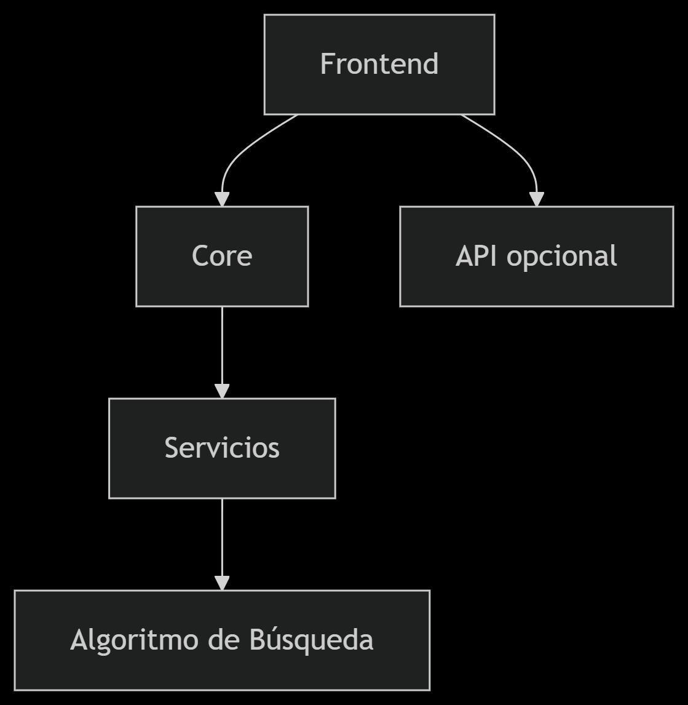

# Documentación Técnica

# Resolvedor de Sopa de Letras
Versión 1.0 | Última actualización: [26-abril-2025]

## 1. Arquitectura del Sistema


* Frontend: React + Vite
* Core: Lógica de negocio independiente
* Servicios: Casos de uso y validaciones

## 2. Stack Tecnológico Detallado
``` bash
Dependencias Principales:
"dependencies": {
  "react": "^19.0.0",
  "react-dom": "^19.0.0",
  "react-icons": "^5.5.0",
  "react-router-dom": "^7.5.2",
  "react-slick": "^0.30.3",
  "styled-components": "^6.1.17"
}
```
### Estructura del proyecto
```bash
sopa-de-letras/
├── public/                    # Archivos estáticos
│   └── favicon.ico            # Icono de la aplicación web
│
├── src/                       # Código fuente
│   ├── assets                 # Imagenes y fuentes
│   |   ├── react.svg
│   |   ├── sopa1.png
│   |   ├── sopa2.png
│   |   ├── sopa3.png
│   |   ├── sopa4.png
│   |   ├── sopa5.png
│   |   ├── sopa6.png
│   |   ├── sopa7.png
│   |   ├── sopa8.png
│   |   └── sopa9.png
│   ├── core/                  # Lógica de negocio (Clean Architecture)
│   │   ├── domain/            # Entidades y modelos
│   │   │   └── WordSearch.js  # Algoritmo de búsqueda
│   │   └── services/          # Casos de uso
│   │       └── WordSearchService.js  
│   │
│   │
│   ├── presentation/          # Interfaz de usuario
│   │   ├── components/        # Componentes reutilizables
│   │   |    ├── Footer/             # Pie de  pagina
|   |   |    |    ├── Footer.jsx
│   │   |    |    └── Footer.module.css
│   │   |    ├── Navbar/             # Barra de navegacion
|   |   |    |    ├── Navbar.css
│   │   |    |    └── Navbar.jsx
│   │   |    ├── WordSearchForm/     # Formulario principal
|   |   |    |    ├── WordSearchForm.css
│   │   |    |    └── WordSearchForm.jsx
│   │   |    └── WordSearchResults/  # Vista resultados
|   |   |    |    ├── WordSearchResults.css
│   │   |    |    └── WordSearchResults.jsx
│   │   ├── pages/             # Vistas principales
│   │   |    ├── AboutPage/    # Acerca de
|   |   |    |    ├── AboutPage.css
│   │   |    |    └── AboutPage.jsx
│   │   |    ├── EditSeachPage/     # Pagina de edicion
|   |   |    |    ├── EditSeachPage.css
│   │   |    |    └── EditSeachPage.jsx
│   │   |    ├── HomePage/     # Pagina principal
|   |   |    |    ├── HomePage.css
│   │   |    |    └── HomePage.jsx
│   │   |    ├── ResultsPage/  # Pagina de resultados
|   |   |    |    ├── ResultsPage.css
│   │   |    |    └── ResultsPage.jsx
│   │   └── styles/            # Estilos globales
│   │   |    └──global.css     # Archivo de estilos
│   │
│   ├── App.jsx                # Componente raíz
│   └── main.jsx               # Punto de entrada
│
├── docs/                      # Documentación
│   ├── GUIA_USUARIO.docx      # Manual de usuario
│   └── TECH.md                # Especificaciones técnicas
│
├── .gitignore                 # Archivos excluidos de Git
├── package.json               # Dependencias y scripts
├── README.md                  # Documentacion 
└── vite.config.js             # Configuración de Vite
```

## 3. Algoritmo de Búsqueda
``` bash
Complejidad: O(n*m*l) donde:
* n: Filas de la matriz
* m: Columnas de la matriz
* l: Longitud de la palabra
```
// Ejemplo del núcleo del algoritmo
```bash
function searchWord(matrix, word) {
  // Implementación 8 direcciones
}
```

## 4. Flujo de Datos


## 5. Guía de Contribución
* Clonar repositorio

* Instalar dependencias:
``` bash
npm install
```
* Ejecutar tests:
``` bash
npm test
```
## 6. Pruebas Unitarias
``` bash
// Ejemplo test con Jest
test('Encuentra palabra horizontal', () => {
  const matrix = [['A','B','C'], ['D','E','F']];
  expect(searchWord(matrix, 'ABC')).toBeTruthy();
});
```
