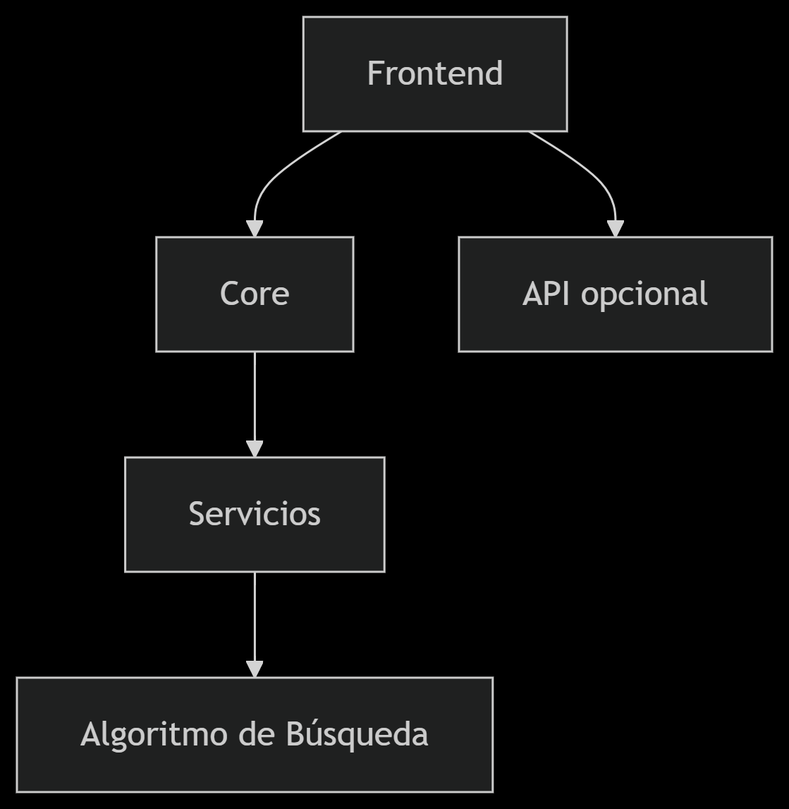
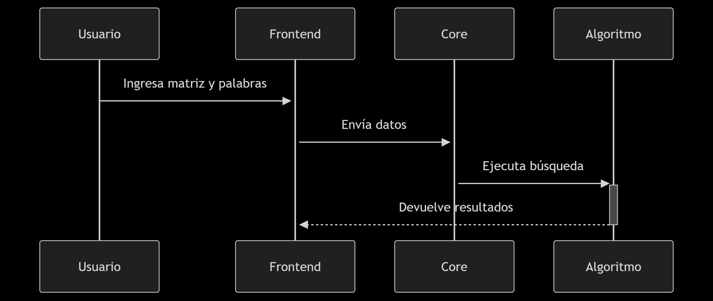

# Documentación Técnica

# Resolvedor de Sopa de Letras
Versión 1.0 | Última actualización: [26-abril-2025]

## 1. Arquitectura del Sistema

* Frontend: React + Vite
* Core: Lógica de negocio independiente
* Servicios: Casos de uso y validaciones

## 2. Stack Tecnológico Detallado
Dependencias Principales:
"dependencies": {
  "react": "^19.0.0",
  "react-dom": "^19.0.0",
  "react-icons": "^5.5.0",
  "react-router-dom": "^7.5.2",
  "react-slick": "^0.30.3",
  "styled-components": "^6.1.17"
}

### Estructura del proyecto
sopa-de-letras/
├── public/
│   └── favicon.ico
|
├── src/
│   ├── assets/
│   |   ├── react.svg
│   |   ├── sopa1.png
│   |   ├── sopa2.png
│   |   ├── sopa3.png
│   |   ├── sopa4.png
│   |   ├── sopa5.png
│   |   ├── sopa6.png
│   |   ├── sopa7.png
│   |   ├── sopa8.png
│   |   └── sopa9.png
│   ├── components/
│   │   ├── Footer/
│   │   │   ├── Footer.jsx
│   │   │   ├── Footer.module.css
│   │   │   └── index.js
│   │   ├── Navbar/
│   │   │   ├── Navbar.jsx
│   │   │   ├── Navbar.module.css
│   │   │   └── index.js
│   │   └── WordSearch/
│   │       ├── WordSearchForm.jsx
│   │       ├── WordSearchForm.module.css
│   │       ├── WordSearchResults.jsx
│   │       ├── WordSearchResults.module.css
│   │       └── index.js
│   ├── pages/
│   │   ├── HomePage/
│   │   │   ├── HomePage.jsx
│   │   │   ├── HomePage.module.css
│   │   │   └── index.js
│   │   ├── ResultsPage/
│   │   │   ├── ResultsPage.jsx
│   │   │   ├── ResultsPage.module.css
│   │   │   └── index.js
│   │   └── AboutPage/
│   │       ├── AboutPage.jsx
│   │       ├── AboutPage.module.css
│   │       └── index.js
│   ├── core/
│   │   ├── domain/
│   │   │   └── WordSearch.js
│   │   └── services/
│   │       └── WordSearchService.js
│   ├── styles/
│   │   ├── globals.css
│   │   └── variables.css
│   ├── App.jsx
│   └── main.jsx
├── docs/
│   ├── GUIA_USUARIO.docx
│   └── TECH.md
├── .gitignore
├── package.json
├── README.md
└── vite.config.js

## 3. Algoritmo de Búsqueda
Complejidad: O(n*m*l) donde:
* n: Filas de la matriz
* m: Columnas de la matriz
* l: Longitud de la palabra

// Ejemplo del núcleo del algoritmo
function searchWord(matrix, word) {
  // Implementación 8 direcciones
}

## 4. Flujo de Datos

## 5. Guía de Contribución
* Clonar repositorio

* Instalar dependencias:
npm install

* Ejecutar tests:
npm test

## 6. Pruebas Unitarias
// Ejemplo test con Jest
test('Encuentra palabra horizontal', () => {
  const matrix = [['A','B','C'], ['D','E','F']];
  expect(searchWord(matrix, 'ABC')).toBeTruthy();
});